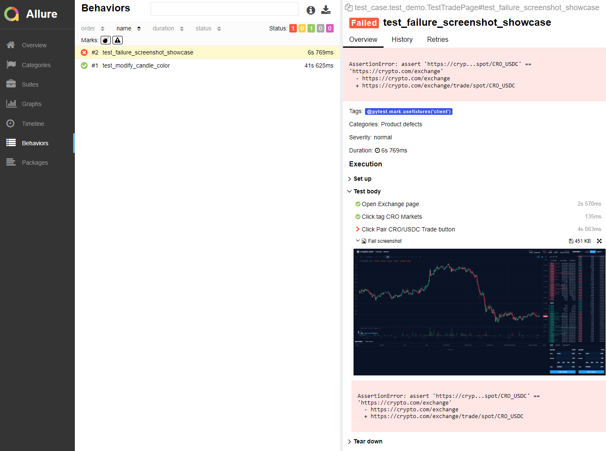

# Setup

## Install Python packages

```
pip install -r requirements.txt
```

## Install Allure

#### For MacOS
```
brew install allure
```

#### For Windows

- Install [Scoop](https://scoop.sh/)

In Powershell run command `iwr -useb get.scoop.sh | iex` to install scoop

- Install [Allure](http://allure.qatools.ru/)

In Powershell run command `scoop install allure`

## Install Chromedriver (MacOS only)
```
brew tap homebrew/cask

brew cask install chromedriver
```

<br />

# Run Test
```
python main.py
```

Supported arguments
```
--browser  | Browser name. Default is "chrome", capable to easily setup other browser
--test     | Path of scripts to execute. Default is "test_case" folder
```

<br />

# Show report
In IDE (e.g. PyCharm), right click `/allure-report/index.html` in project file tree, and select "Open in browser -> Chrome"
<br />


<br />

# Structure Design
```
| helper     - helper class e.g. web_client and utils
| element    - web element locator
| page       - business logic functions based on each web page
| test_case  - test script .py files
| webdriver  - optional executable webdriver file storage e.g. chromedriver.exe
```
- BDD style test scripts design
- Dynamic Trade button locator to locate any pair of currency/e-coin
- Automatic screenshot attached to Allure report when test failed
- Dynamic report and log files generation

<br />

# Test Case Design
#### test_modify_candle_color
1. Open Exchange page via URL
2. Click tag CRO Markets
3. Click CRO/USDC Trade button
4. Click Header Properties Settings icon at top-right of canvas
5. Click Style tag in pop up window
6. Click canvas candle color one selector
7. Select blue color
8. Click OK button to apply changes

#### test_failure_screenshot_showcase
##### This test case will run fail as expected, in order to show the automatic screenshot feature
1. Open Exchange page via URL
2. Click tag CRO Markets
3. Click CRO/USDC Trade button
4. Assert an incorrect page URL to raise a test defect